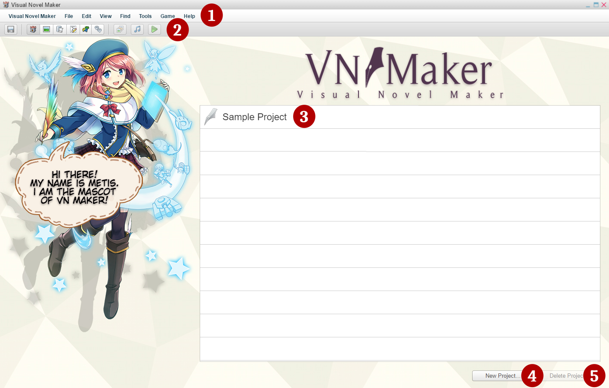

# 2.1 Homeview Screen

---

After launching Visual Novel Maker, you will enter the **Homeview** screen.

**1\. The Menu Bar**

Functions available in this software are selected from here. For more information, visit [The Menu Bar]() page.

**2\. Toolbar**

You can access certain pages by clicking buttons on the toolbar. For more information, visit [The Toolbar]() page.

**3\. Project List**

This section shows your recently made and/or opened projects.

**4\. New Project**

This button allows you to create new projects. For more information, visit the [Getting Started]() Page.

**5\. Delete Project**

This button permanently deletes a project selected. Use it with caution.

---
[2. Exploring the Editor](2.%20Exploring%20the%20Editor)[2.1.1 Getting Started](2.1.1%20Getting%20Started)
