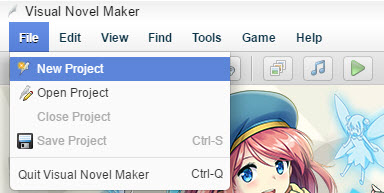
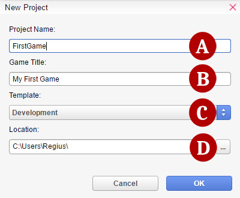
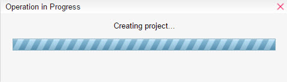
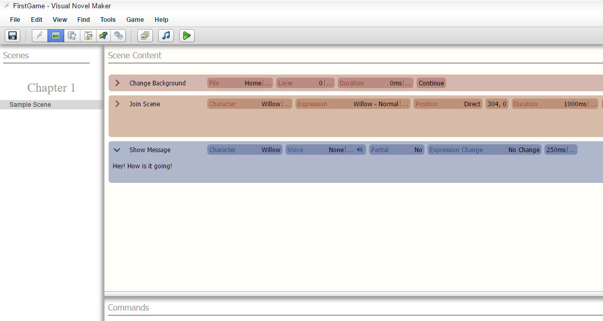
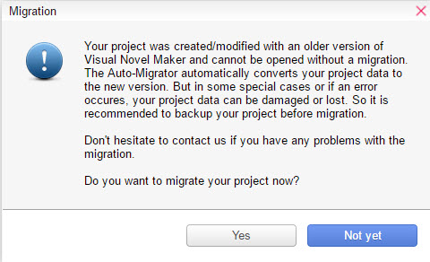

# 2.1.1 Getting Started

---

#### Creating a Project

---

First we must create a project. A project is a collection of data and resources that constitutes your game.

You can also import your own images and music by importing files into your project through the [Resource Manager]().

Here are the steps to make one:

1\. Click **File** ->  **New Project**

2\. The New Project Window will appear.

**A. Project Name** - The name of the project's folder

**B. Game Title** - The title of the project that appears in the game window.

**C. Template** - A premade project that provides you various options to set up your game easier.

**D. Location** - The folder path where the project will be saved.

3\. Wait for the Operation in Progress window to finish.

4\. Your Project is now created! You are now free to start developing your game.

#### Managing your Projects

---

**Saving/Loading**

If you want to take a break from working on your project and/or close the program, make sure that you save your project before doing so.

Click the  Save button (or click File ->  Save Project) to save the project you are currently working on. This overwrites any existing data for the same project.

**Opening a Project**

There are two different ways to open your project.

* Simply select your project in the Project List from the [Homeview Screen]() and double-click it.
* Click the  Open Project button (or click File ->  Open Project), select the folder of the project you want to open.

**Migration System**

Sometimes when you create a new project or open a new project after a program update, a window called Migration will appear.

This prompt asks you if you want to update your project to the latest version. It is highly recommended that you do so to ensure that bugs and other issues can be fixed. It is not possible to open your project without migrating it first.

**Backing Up/Deleting a Project**

Project content is saved all together in the folder you specified at the time you first created it. To back it up, simply copy the entire folder to another hard disk, removable media, and so on. To delete a project you no longer need, simply click Delete Project button if it's in Project List. If the project is not listed, just delete the project folder in the usual manner.

---
[2.1 Homeview Screen](quiver:///notes/7FBC6262-772A-40BE-BE89-128A21428A49)[2.1.2 The Menu Bar](quiver:///notes/29A4FE4E-AD30-443D-96FA-05E5A453E84A)